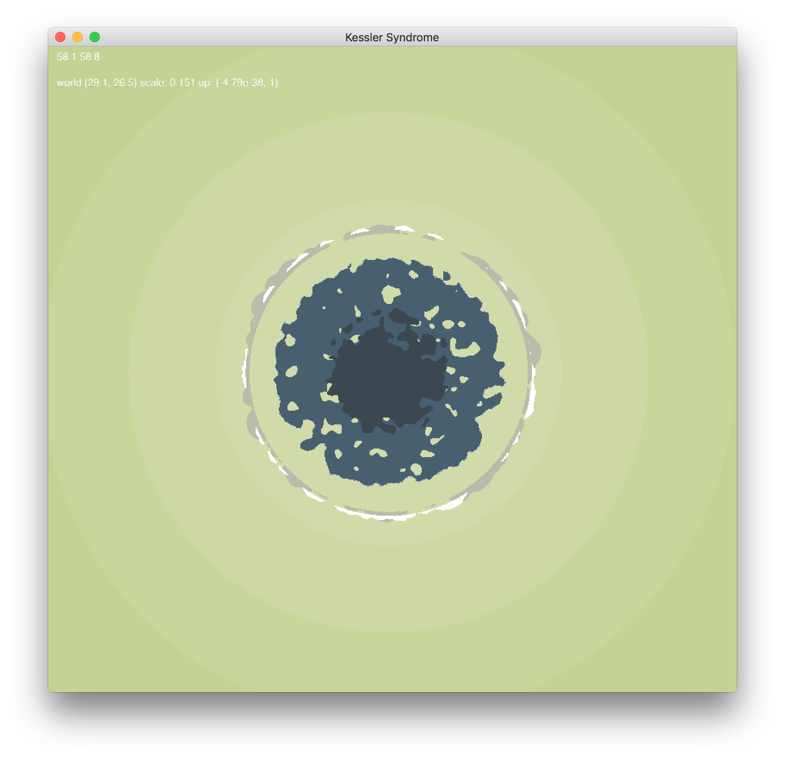
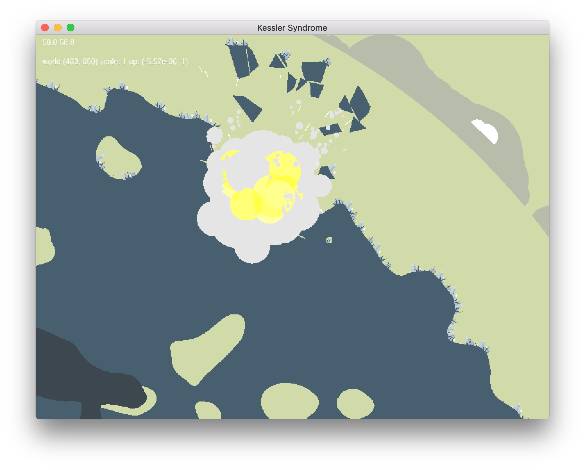
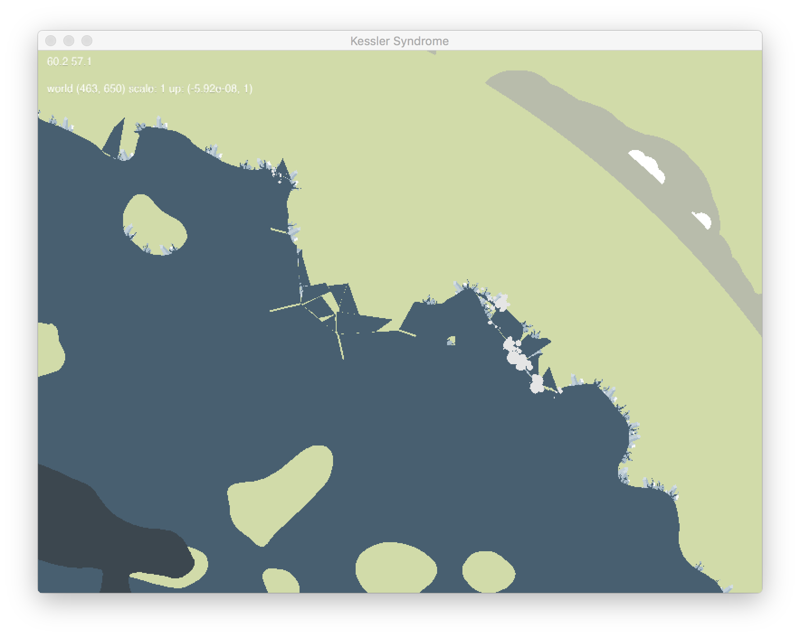

# Kessler Syndrome
An in-progress Tank Wars / Scorched Earth type game, for two players. With destructible terrain and a circular planet.

## Building

- Unpack Chipmunk Physics (7.0.1) into `vendor/Chipmunk-7.0.1`
- Unpack LibCinder (0.9.0) into `vendor/cinder_0.9.0_mac`
- Open `xcode/KesslerSyndrome.xcodeproj`
- Run `KesslerSyndrome` scheme

## Features

- Destructible 2D terrain, where bombs shatter the world, casting rock into orbit. 
- Cool random world generation via noise & marchine squares
- Uh, not much else, yet

## Screenshots

Full view of a world:

Kaboom!

And, the aftermath!

## TODO
- Multi-camera, with voronoi split-screen
- Actual gameplay, I guess